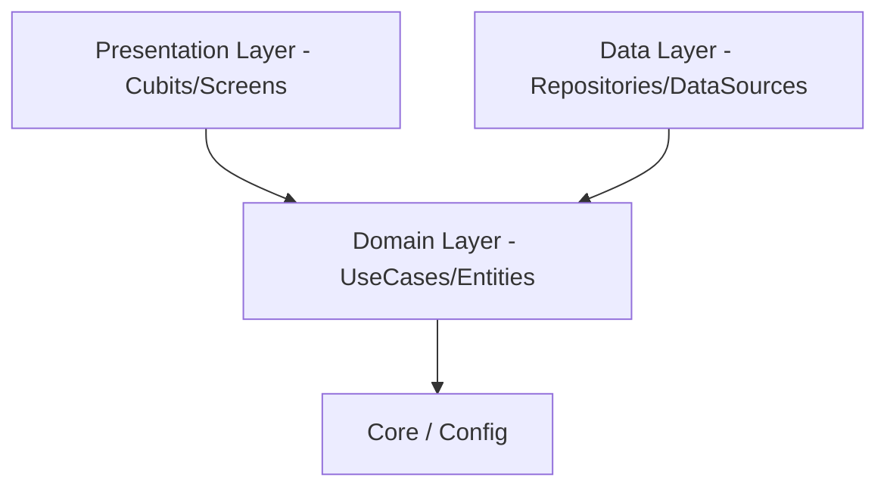

# msaratwasel-services System Documentation

This document serves as the Single Source of Truth (SSOT) and Design Intent record for the Msarat Wasel Services project.

---

## 1. Single Source of Truth (SSOT)

### System Overview
**Msarat Wasel Services** is a professional production mobile application designed to streamline school attendance management. It provides a multi-role digital platform for tracking student attendance via QR scanning, managing classroom data, and generating attendance reports.

### High-Level Architecture
The project follows **Clean Architecture** principles, separating concerns into distinct layers to ensure maintainability, testability, and scalability.

### Core Domains and Responsibilities
| Domain | Responsibility |
| :--- | :--- |
| **Auth** | User identity management, role-based access control, and session persistence. |
| **Teacher** | Classroom management, student rosters, and attendance verification. |
| **Assistant / Driver** | QR code scanning for physical attendance tracking during trips. |
| **Reports** | Data visualization of attendance trends and historical records. |
| **Shared** | Cross-cutting features like Settings, Profile, and QR scanning utilities. |

### Tech Stack and Key Libraries
| Library | Purpose | Reason for Selection |
| :--- | :--- | :--- |
| **Flutter BLoC** | State Management | Predictable state changes and clear separation of logic from UI. |
| **GoRouter** | Navigation | Declarative routing with support for deep linking and role-based redirects. |
| **Dartz (Either)** | Functional Programming | Robust error handling without relying on try-catch blocks in higher layers. |
| **Equatable** | Value Equality | Simplified object comparison for efficient BLoC state updates. |
| **Mobile Scanner** | QR Processing | High-performance, native-speed barcode and QR detection. |
| **FL Chart** | Analytics | Flexible and performant charting for attendance statistics. |

### Environment Setup and Execution Flow
1. **Dependencies**: Ensure Flutter SDK 3.10.4+ is installed. Execute `flutter pub get`.
2. **Localization**: The project uses `generate: true`. Run `flutter gen-l10n` if required.
3. **Execution**:
   - `main.dart` initializes dependencies (Local Data Sources, Theme/Settings Controllers).
   - `AppRouter` evaluates initial authentication state.
   - Users are directed to `LoginScreen` or their respective `HomeScreen` (Teacher, Assistant, etc.).

### Naming Conventions and Folder Structure
- **Folder Structure**: Clean Architecture based on Roles and Features.
  - `lib/features/[role]/[feature_name]/[data|domain|presentation]`
- **Naming**:
  - Files: `snake_case.dart` (e.g., `auth_repository_impl.dart`)
  - Classes: `PascalCase` (e.g., `LoginUseCase`)
  - Variables/Methods: `camelCase`

---

## 2. Design Intent Documentation

### Authentication & Authorization
**Intent**: Centralized identity management that determines the entire application flow.
- **Why**: Securing student data and ensuring role-specific functionality is critical.
- **Approach**: `AuthCubit` manages a global `AuthState`. `AppRouter` uses this state to guard routes.
- **Assumptions**: Users have a unique Civil ID and a password.
- **Business Logic Boundary**: The mapping between Civil IDs and roles in `AuthRemoteDataSourceImpl` is currently mocked for testing but represents the strict logic for real data integration.

### Feature Grouping (The "Shared" Folder)
**Intent**: Consolidate universally required capabilities to avoid duplication.
- **Why**: Features like `auth`, `profile`, and `qr_scan` are not tied to a single user role (e.g., both Drivers and Assistants scan QR codes).
- **Pattern**: Features moved to `features/shared/` are treated as modular dependencies used by specific role-based screens.
- **Constraints**: Moving a feature out of `shared` back to a specific role folder should be avoided if multiple roles utilize it.

### Theme and Design System
**Intent**: Deliver a high-quality "Wow" factor with consistent branding.
- **Why**: Professionalism in school environments increases trust.
- **Approach**: `AppTheme` provides Light/Dark modes using a custom `BrandColors` palette and `AppSpacing` tokens.
- **Business Logic Boundary**: UI components should never use hardcoded colors; they must always reference the `Theme.of(context)` or `BrandColors` to maintain visual integrity during theme switches.

---

**Version**: 1.0.0
**Compiled by**: Antigravity Architect Unit
