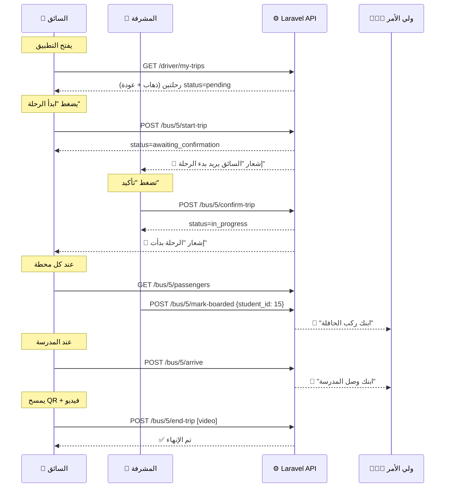

# 🔗 API Contract — نظام الرحلات (Laravel ↔ Flutter)

## 📊 الوضع الحالي

### ✅ الـ Endpoints الموجودة في Laravel

| # | Method | Endpoint | الوصف | الحالة |
|:-:|:------:|----------|-------|:------:|
| 1 | `POST` | `/api/bus/{bus}/start-trip` | بدء الرحلة | ✅ يعمل |
| 2 | `GET` | `/api/bus/{bus}/passengers` | قائمة الطلاب + حالة الرحلة | ✅ يعمل |
| 3 | `POST` | `/api/bus/{bus}/mark-boarded` | تسجيل ركوب طالب | ✅ يعمل |
| 4 | `POST` | `/api/bus/{bus}/group-board` | تسجيل ركوب مجموعة | ✅ يعمل |
| 5 | `POST` | `/api/bus/{bus}/mark-dropped` | تسجيل نزول طالب | ✅ يعمل |
| 6 | `POST` | `/api/bus/{bus}/arrive` | وصول + إنزال الكل + إنهاء | ✅ يعمل |
| 7 | `POST` | `/api/bus/{bus}/end-trip` | إنهاء مع فيديو التحقق | ✅ يعمل |

### 📱 ما يستخدمه Flutter حالياً

| الملف | يستدعي | ملاحظة |
|-------|--------|--------|
| `home_repository_impl.dart` | `GET bus/{bus}/passengers` | لجلب حالة الرحلة |
| `home_repository_impl.dart` | `POST bus/{bus}/start-trip` | لبدء الرحلة |
| `trip_repository_impl.dart` | `POST bus/{bus}/end-trip` | لإنهاء الرحلة + فيديو |
| `trip_repository_impl.dart` | `POST bus/{bus}/board` ❌ | **خطأ!** الـ endpoint الصحيح هو `mark-boarded` |
| `trip_repository_impl.dart` | `POST bus/{bus}/alight` ❌ | **خطأ!** الـ endpoint الصحيح هو `mark-dropped` |

> [!WARNING]
> **فجوة #1**: Flutter يستدعي `/bus/{bus}/board` و `/bus/{bus}/alight` لكن Laravel يسجلها كـ `/bus/{bus}/mark-boarded` و `/bus/{bus}/mark-dropped`. لازم يتطابقوا!

---

## 🔴 الفجوات بين Flutter و Laravel

### فجوة 1: أسماء Endpoints غير متطابقة

| Flutter يستدعي | Laravel يستقبل | الحل |
|----------------|----------------|------|
| `POST /bus/{id}/board` | `POST /bus/{id}/mark-boarded` | نوحّد الاسم في أحدهما |
| `POST /bus/{id}/alight` | `POST /bus/{id}/mark-dropped` | نوحّد الاسم في أحدهما |

### فجوة 2: Flutter لا يدعم تأكيد المشرفة

حسب القرار: **السائق يبدأ ← المشرفة تؤكد ← الرحلة تنطلق**

حالياً `start-trip` يحول مباشرة لـ `in_progress`. نحتاج:
```
السائق: POST start-trip → status = awaiting_confirmation
المشرفة: POST confirm-trip → status = in_progress
```

### فجوة 3: لا يوجد endpoint لجلب رحلات السائق اليوم

Flutter يحتاج يعرض **قائمة رحلات اليوم** (ذهاب + عودة) مع حالة كل رحلة.

### فجوة 4: `TripStatus` entity ناقصة

الـ entity الحالية:
```dart
class TripStatus {
  final String id;
  final String departureTime;
  final int totalStudents;
  final bool isStarted;     // ← بسيط جداً
  final bool isCompleted;   // ← لا يدعم awaiting_confirmation
}
```

---

## 📋 API Contract المحدّث (الكامل)

### 1️⃣ `GET /api/driver/my-trips` — رحلات السائق اليوم 🆕

> السائق يفتح التطبيق ويشوف رحلاته

**Response:**
```json
{
  "date": "2026-04-22",
  "bus": {
    "id": 5,
    "bus_number": "B-005",
    "plate_number": "أ ح د 1234"
  },
  "trips": [
    {
      "id": 42,
      "type": "forth",
      "type_label": "ذهاب",
      "status": "pending",
      "total_students": 25,
      "excused_count": 2,
      "departure_time": null,
      "arrival_time": null,
      "route": {
        "id": 3,
        "name": "حي النزهة"
      }
    },
    {
      "id": 43,
      "type": "back",
      "type_label": "عودة",
      "status": "pending",
      "total_students": 23,
      "excused_count": 3,
      "departure_time": null,
      "arrival_time": null,
      "route": {
        "id": 3,
        "name": "حي النزهة"
      }
    }
  ]
}
```

---

### 2️⃣ `POST /api/bus/{bus}/start-trip` — بدء الرحلة (السائق)

> السائق يضغط "ابدأ الرحلة"

**Response:**
```json
{
  "message": "تم طلب بدء الرحلة. بانتظار تأكيد المشرفة.",
  "trip_id": 42,
  "status": "awaiting_confirmation"
}
```

---

### 3️⃣ `POST /api/bus/{bus}/confirm-trip` — تأكيد المشرفة 🆕

> المشرفة تضغط "تأكيد بدء الرحلة"

**Request:**
```json
{
  "trip_id": 42
}
```

**Response:**
```json
{
  "message": "تم تأكيد بدء الرحلة.",
  "trip_id": 42,
  "status": "in_progress",
  "departure_time": "2026-04-22T06:30:00"
}
```

---

### 4️⃣ `GET /api/bus/{bus}/passengers` — قائمة الطلاب ✅ موجود

> **لا يحتاج تعديل** — الـ response الحالي ممتاز وشامل

---

### 5️⃣ `POST /api/bus/{bus}/mark-boarded` — ركوب طالب ✅ موجود

**Request:**
```json
{
  "student_id": 15
}
```

**Response:**
```json
{
  "message": "تم تسجيل ركوب الطالب بنجاح.",
  "new_status": "onBus",
  "attendance": { "id": 99, "trip_id": 42, "student_id": 15, "status": "boarded" }
}
```

---

### 6️⃣ `POST /api/bus/{bus}/mark-dropped` — نزول طالب ✅ موجود

**Request:**
```json
{
  "student_id": 15
}
```

**Response:**
```json
{
  "message": "تم تسجيل نزول الطالب بنجاح.",
  "new_status": "atSchool",
  "attendance": { "id": 99, "trip_id": 42, "student_id": 15, "status": "dropped" }
}
```

---

### 7️⃣ `POST /api/bus/{bus}/arrive` — وصول + إنزال الكل ✅ موجود

**لا يحتاج تعديل.**

---

### 8️⃣ `POST /api/bus/{bus}/end-trip` — إنهاء + فيديو ✅ موجود

**Request:** `multipart/form-data`
```
video: [file.mp4]
start_qr_data: "FRONT-5"
end_qr_data: "BACK-5"
start_qr_scanned: true
end_qr_scanned: true
```

**لا يحتاج تعديل.**

---

### 9️⃣ `GET /api/driver/trip-history` — تاريخ الرحلات 🆕

> السائق يشوف رحلاته السابقة

**Query:** `?page=1&per_page=20`

**Response:**
```json
{
  "data": [
    {
      "id": 42,
      "date": "2026-04-22",
      "type": "forth",
      "status": "finished",
      "total_students": 25,
      "boarded_count": 23,
      "departure_time": "06:30",
      "arrival_time": "07:15"
    }
  ],
  "meta": { "current_page": 1, "last_page": 5 }
}
```

---

## 📐 تدفق الرحلة الكامل (Sequence)



---

## ✏️ التعديلات المطلوبة

### Backend (Laravel) — 3 تعديلات:

| # | التعديل | الملف |
|:-:|---------|-------|
| 1 | إضافة `awaiting_confirmation` لحالات `trips` | migration + Trip model |
| 2 | إنشاء `GET /api/driver/my-trips` | `DailyTripApiController` أو controller جديد |
| 3 | إنشاء `POST /api/bus/{bus}/confirm-trip` | `DailyTripApiController` |

### Flutter — 4 تعديلات:

| # | التعديل | الملف |
|:-:|---------|-------|
| 1 | تصحيح endpoint `/board` → `/mark-boarded` و `/alight` → `/mark-dropped` | `trip_repository_impl.dart` |
| 2 | إضافة `getMyTrips()` للـ repository | `home_repository.dart` + impl |
| 3 | تحديث `TripStatus` entity لدعم الحالات الجديدة | `trip_status.dart` |
| 4 | إضافة شاشة قائمة الرحلات اليومية (بدل عرض رحلة واحدة) | شاشة جديدة |

---

## ❓ سؤال لصاحبك

> [!IMPORTANT]
> هل صاحبك يشتغل على Flutter فقط ولا على Backend كمان؟
> - لو **Flutter فقط** → أنا أسوي تعديلات Laravel وأعطيه الـ API Contract هذا يطبقه
> - لو **الاثنين** → نقسم الشغل: أنا Backend وهو Flutter، أو العكس
> - لو **تبيني أسوي الكل** → أبدأ بالـ Backend ثم Flutter
